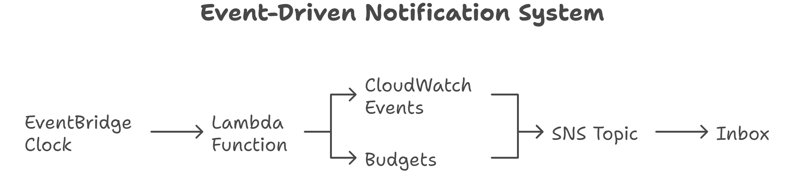

# AWS Cost Optimization Bot



## Overview
A serverless solution that provides proactive cost alerts and daily email reports of your AWS spend, including month-to-date total, forecast, and top services. The system sends threshold alerts when you cross 80% and 100% of your budget.

## Features

- **Daily Cost Reports**: Get a comprehensive email with your AWS spend overview
- **Budget Alerts**: Receive notifications at 80% and 100% of your budget
- **Cost Forecast**: View predicted end-of-month spend
- **Top Services**: See which AWS services are driving your costs
- **Serverless**: Built with AWS Lambda, EventBridge, and SNS for maximum scalability
- **Security**: IAM roles with least-privilege permissions

## Architecture

```
EventBridge (cron) → Lambda (Cost bot) → Cost Explorer API → Format report → SNS Topic → Email/SMS/Webhook
In parallel: AWS Budgets → SNS Topic when thresholds hit
```

## Prerequisites

- AWS Account with Billing access
- IAM user with AdministratorAccess or equivalent permissions
- Cost Explorer enabled
- Python 3.11 (for local development)
- AWS CLI configured

## Deployment

### 1. Create SNS Topic
1. Go to SNS → Topics → Create topic
2. Choose "Standard" type
3. Name it `CostAlertsTopic`
4. Create a subscription with your email address
5. Confirm the subscription from your email

### 2. Configure AWS Budgets Access
1. Go to SNS → Your topic → Access policy
2. Add the following statement (replace placeholders):
```json
{
  "Version": "2012-10-17",
  "Statement": [{
    "Sid": "AllowBudgetsToPublish",
    "Effect": "Allow",
    "Principal": { "Service": "budgets.amazonaws.com" },
    "Action": "SNS:Publish",
    "Resource": "arn:aws:sns:<REGION>:<ACCOUNT_ID>:CostAlertsTopic"
  }]
}
```

### 3. Create AWS Budget
1. Go to Billing → Budgets → Create budget
2. Select "Cost budget"
3. Set your monthly budget amount
4. Configure alerts at 80% and 100% of actual costs
5. Set notification to your SNS topic

### 4. Deploy Lambda Function
1. Create a new Lambda function with Python 3.11 runtime
2. Name it `CostOptimizationBot`
3. Use the provided Python code
4. Set the following environment variables:
   - `TOPIC_ARN`: Your SNS topic ARN
   - `BUDGET_LIMIT`: Your monthly budget amount
   - `ALERT_THRESHOLDS`: "80,100,120"
   - `CURRENCY`: "USD"
   - `SERVICES_LIMIT`: "5"

### 5. Create IAM Role
Create an IAM role with the following permissions:
- `AWSLambdaBasicExecutionRole` (for CloudWatch logs)
- Custom policy for:
  - `ce:GetCostAndUsage`
  - `ce:GetCostForecast`
  - `budgets:ViewBudget`
  - `sns:Publish` (restricted to your SNS topic)

### 6. Schedule with EventBridge
1. Create a new EventBridge rule
2. Set schedule to `cron(30 3 * * ? *)` (9:00 AM IST)
3. Target your Lambda function

## Testing

1. **Manual Test**:
   ```bash
   aws lambda invoke --function-name CostOptimizationBot output.txt
   ```

2. **Check Logs**:
   ```bash
   aws logs tail /aws/lambda/CostOptimizationBot --follow
   ```

3. **Test Budget Alerts**:
   - Temporarily lower your budget threshold
   - Make a small AWS charge
   - Verify you receive the alert email

## Sample Email Output

```
AWS Cost Daily Brief — 2025-09-29
--------------------------------
Month-to-date (MTD): USD 45.67
Budget: USD 100.00  |  Used: 45.7%
Forecast (end of month): USD 98.23
Yesterday's spend: USD 1.23  (Δ vs prev day: USD 0.12)

Top services this month:
  • Amazon EC2: USD 25.00
  • Amazon RDS: USD 12.50
  • AWS Lambda: USD 5.20
  • Amazon S3: USD 2.50
  • Amazon CloudFront: USD 1.20
```

## Cleanup

To avoid unnecessary charges:
1. Delete the Lambda function
2. Remove the EventBridge rule
3. Delete the SNS topic and subscription
4. Remove the IAM role and policies
5. Delete any test budgets

## License

This project is licensed under the MIT License - see the [LICENSE](LICENSE) file for details.

## Acknowledgements

- AWS Documentation
- AWS Cost Explorer API
- AWS Lambda Python Runtime

## Contact

For questions or feedback, please open an issue in the repository.
